# RPYPolarSynthetic

Synthetic experiments for a **Roll-Pitch-Yaw stratified polar/bearing camera observation model**.

The project tests whether a camera observation can be decomposed into:

- a radial/bearing-angle part `theta`, mainly useful for tilt estimation;
- an angular part `phi`, useful for heading / in-plane optical-axis yaw;
- a covariance-aware residual that respects pixel-noise propagation and the optical-axis singularity.

The current repository contains five experiment layers:

1. `run_experiment.py`: a clean single-view sanity check.
2. `run_ba_experiment.py`: a harder two-view inverse-depth BA stress test.
3. `run_exp3_experiment.py`: a more realistic three-view local BA stress test with unknown translations and weak baseline-length priors.
4. `run_exp4_experiment.py`: a free-`XYZ` multi-track BA comparison between local and global regimes.
5. `run_exp5_experiment.py`: a UAV-style oblique multi-strip free-`XYZ` BA stress test.

## Project-Specific RPY Convention

This project uses a deliberately non-navigation RPY convention. The word `yaw` here means **an in-plane rotation around the current camera optical axis**. It is not the usual vehicle / IMU heading angle around gravity.

The convention is:

| Variable | Meaning in this project |
|---|---|
| `roll` | first tilt rotation around the camera `x` axis |
| `pitch` | second tilt rotation around the camera `y` axis |
| `yaw` | final rotation around the camera optical axis `z` |

The rotation order is:

```text
R = Rz(yaw) Ry(pitch) Rx(roll)
```

For a point direction `q = [x, y, z]^T` after the roll-pitch tilt layer:

```text
theta = atan2(sqrt(x^2 + y^2), z)
phi   = atan2(y, x) + yaw
```

Thus `theta` is decoupled from optical-axis yaw, while `phi` shifts linearly with yaw. This is the geometric basis for the staged optimization.

This naming is intentional. If `yaw` is instead defined as a world-frame heading around gravity, the exact `theta`/`phi` decoupling used by this experiment generally does not hold.

## Why Polar, Why Staged

This repository is really a method-evolution story rather than a single optimizer proposal:

1. start from the standard `uv_joint` reprojection baseline;
2. expose the geometry with `polar_plain_joint`;
3. repair that polar residual statistically to obtain `polar_cov_joint`;
4. then stratify the search to obtain `polar_staged`.

The central claim is therefore not just "polar is better than uv". The stronger claim is:

- polar coordinates reveal a useful split between `theta` and `phi`;
- covariance propagation is needed to make that split statistically sound;
- staged optimization is needed when a direct joint solve still falls into a bad basin under strong coupling.

### Core Geometric Idea

After the roll-pitch tilt layer, the repository uses:

```text
theta = atan2(sqrt(x^2 + y^2), z)
phi   = atan2(y, x) + yaw
```

So, under this project's convention:

- `theta` is the bearing angle away from the optical axis and is mainly informative for `roll/pitch`;
- `phi` is the in-plane azimuth and is shifted almost linearly by the final optical-axis `yaw`.

That exact decoupling is the geometric reason a staged solver is plausible at all.

### Why Not Stop At `uv_joint`?

`uv_joint` is the natural baseline:

- it works directly in image coordinates;
- it uses the standard reprojection residual;
- it is generic and familiar.

But it hides the specific geometry this repository wants to exploit. In `uv`, the radial part and the azimuthal part are mixed together, so the optimizer is not told explicitly that:

- one part of the observation is mainly about tilt;
- another part is mainly about optical-axis yaw.

That motivates trying a polar observation model.

### Why `polar_plain_joint` Was Not Enough

`polar_plain_joint` is the first geometric rewrite:

- convert image observations into `[theta, phi]`;
- optimize directly in that space;
- test whether the decoupling has real value.

Its role is important, but it is intentionally incomplete. Raw polar residuals are geometrically meaningful and still statistically naive:

- equal weighting in `[theta, phi]` does not match the covariance induced by pixel noise;
- `phi` is angular and must be wrapped;
- near the optical axis, `phi` becomes physically ill-conditioned and should not be trusted as much as off-axis `phi`.

So `polar_plain_joint` is best understood as a bridge method: it isolates the geometry, then reveals what is still wrong.

### How `polar_cov_joint` Is Constructed

`polar_cov_joint` is the statistically repaired version of raw polar optimization.

Its implementation story is:

1. start from noisy image pixels;
2. unproject them into bearing directions;
3. convert the bearing into `[theta, phi]`;
4. propagate isotropic pixel covariance into a local polar covariance;
5. wrap `dphi` into `[-pi, pi)`;
6. whiten `[dtheta, dphi]` using the propagated covariance;
7. down-weight the `phi` component near the optical axis.

So `polar_cov_joint` is not "polar plus some ad hoc weights". It is a specific answer to the question:

```text
If the geometry really wants a polar residual,
how do we make that residual statistically honest?
```

### Four Methods At A Glance

| Method | Residual space | Covariance-aware | Wrap `phi` | Gate near optical axis | Search strategy | Main limitation |
|---|---|---:|---:|---:|---|---|
| `uv_joint` | image-plane `uv` | pixel sigma only | no | no | direct joint solve | hides `theta/phi` geometry |
| `polar_plain_joint` | raw `[theta, phi]` | no | no | no | direct joint solve | geometrically meaningful but statistically weak |
| `polar_cov_joint` | whitened polar residual | yes | yes | yes | direct joint solve | still vulnerable to bad basins under strong coupling |
| `polar_staged` | same cov-aware polar residual family | yes | yes | yes | staged init, then final joint solve | more complex schedule and more optimizer steps |

### Why `polar_cov_joint` Still Was Not The End

Even after the residual becomes covariance-aware, the hard BA problems in this repository still have another failure mode:

- the state is coupled;
- initialization can be very poor;
- a direct joint solve may let the wrong variables absorb the orientation error;
- once the optimizer enters the wrong basin, a good residual alone may not rescue it.

That is why `polar_staged` is not just another residual choice. It is a search-strategy change.

### What Problem Does `polar_staged` Actually Solve?

`polar_staged` does **not** primarily solve the optical-axis singularity problem. That problem is addressed earlier, inside the covariance-aware polar residual itself through:

- `phi` wrapping;
- propagated polar covariance;
- and down-weighting `phi` near the optical axis.

So the main job of `polar_staged` is different:

- it addresses **bad initialization under strong coupling**;
- it reduces the chance that a direct joint solve enters the wrong basin;
- it prevents the hardest coupled variables from absorbing orientation error too early.

In other words:

- `polar_cov_joint` makes the polar residual statistically usable;
- `polar_staged` makes the optimization path more robust when the state is hard to initialize.

This is why the staged method becomes important mainly in BA-style problems rather than in the cleanest pose-only sanity check.

More concretely, the repository is targeting situations where:

- the initial optical-axis yaw can be very wrong;
- tilt and yaw are not the only unknowns;
- depth, inverse depth, translation, or free `XYZ` structure can compensate for pose error if they are released too early.

That is the key failure mode behind the staged design:

```text
wrong pose init
-> direct joint optimization lets coupled variables absorb the error
-> optimizer enters a wrong basin
-> a good residual alone may not recover the correct solution
```

The staged answer is:

```text
first fix tilt using theta-only information
then fix optical-axis yaw using phi-only information
only then release the full coupled BA state
```

So `polar_staged` should be understood mainly as a **basin-rescue mechanism for coupled BA**, not merely as a singularity fix and not merely as a large-yaw trick.

The current experiments do use large initial yaw error as the main stress axis, so that is where the advantage is most visible. But the deeper reason is not the yaw variable by itself. The deeper reason is that poor pose initialization can be mis-explained by other coupled variables if the optimizer is allowed to move everything at once.

### How `polar_staged` Works

The generic staged pattern is:

```text
Stage B: theta-only update
  optimize tilt variables only
  keep yaw and coupling variables fixed

Stage C: phi-only update
  optimize yaw only
  keep updated tilt and coupling variables fixed

Stage D: final covariance-aware joint BA
  release the full state needed by that experiment
  jointly refine everything in the good basin
```

The key design principle is:

- during staged rotation initialization, do not let the hardest coupled variables absorb orientation error;
- only after a reasonable pose basin has been found, hand the problem back to the full joint optimizer.

### What Exactly Is Optimized In Each Stage?

For the simplest pose-only experiment:

- `theta-only` updates `roll/pitch` while keeping `yaw` fixed;
- `phi-only` updates `yaw` while keeping the updated `roll/pitch` fixed;
- final joint optimization releases all `3` pose variables.

For the BA experiments, the staged logic is the same but the frozen variables depend on the state parameterization:

| Experiment family | `theta-only` stage | `phi-only` stage | Final joint stage |
|---|---|---|---|
| Experiment 1 pose-only | optimize `roll/pitch`, fix `yaw` | optimize `yaw`, fix updated `roll/pitch` | release all pose variables |
| Experiment 2 inverse-depth BA | optimize pose rotation only, fix inverse depths | optimize yaw only, fix updated tilt and inverse depths | release pose + inverse depths |
| Experiment 3 realistic local BA | optimize target-view `roll/pitch`, fix target-view yaw, translations, inverse depths | optimize target-view yaw, fix updated tilt, translations, inverse depths | release pose + translations + inverse depths |
| Experiment 4 free-`XYZ` BA | optimize later-view `roll/pitch`, fix later-view yaw, centers, point `XYZ` | optimize later-view yaw, fix updated tilt, centers, point `XYZ` | release rotations + centers + point `XYZ` |
| Experiment 5 airborne block | same as Exp4, but with one extra `theta-only -> phi-only` alternation before the final stage | same as Exp4 | release rotations + centers + point `XYZ` |

The reason for freezing those BA variables is deliberate:

- if depth, translation, or `XYZ` are free too early, they can absorb pose error;
- that destroys the geometric separation that staged initialization is trying to exploit.

### How Does `polar_staged` Enter The Final Joint BA?

`polar_staged` is not a separate terminal solver. It is a basin-finding front-end for the final covariance-aware joint solve.

The handoff is:

1. run restricted `theta-only` optimization;
2. run restricted `phi-only` optimization;
3. pack the updated pose variables back into a full experiment state;
4. use that state as the initialization for the full covariance-aware joint optimization.

So the final optimizer is not starting from the raw Monte-Carlo perturbation. It is starting from a pose that has already been partially untangled.

### Why Exp5 Uses Two Alternations

Experiments 1-4 use one `theta-only -> phi-only` pass.

Experiment 5 uses:

```text
theta-only -> phi-only -> theta-only -> phi-only -> final joint BA
```

The intended interpretation is modest:

- Exp5 is a larger and more strongly coupled airborne multi-strip block;
- one extra bounded alternation gives tilt and optical-axis yaw one more chance to re-align before the full free-`XYZ` BA is released.

This repository does **not** claim that more and more staged cycles must monotonically improve the result. In the current method story, repeated staging should be read as a limited block-coordinate initializer, not as an indefinitely repeated outer loop that replaces final joint BA.

## Project Layout

```text
RPYPolarSynthetic/
  run_experiment.py
  run_ba_experiment.py
  run_exp3_experiment.py
  run_exp4_experiment.py
  run_exp5_experiment.py
  src/rpy_polar_synth/
    airborne_strip_experiment.py
    geometry.py
    experiment.py
    ba_experiment.py
    realistic_ba_experiment.py
    free_xyz_ba_experiment.py
    visualize.py
  outputs/
    monte_carlo_results.csv
    scene_3d.png
    image_measurements.png
    axis_singularity.png
    cost_landscape.png
    cost_landscape_pitch_yaw.png
    cost_landscape_roll_yaw.png
    cost_landscape_roll_pitch.png
    cost_landscape_all_slices.png
    monte_carlo_summary.png
  outputs_ba/
    ba_monte_carlo_results.csv
    ba_scene_3d.png
    ba_monte_carlo_summary.png
  outputs_exp3/
    exp3_monte_carlo_results.csv
    exp3_scene_3d.png
    exp3_monte_carlo_summary.png
  outputs_exp4/
    exp4_local_results.csv
    exp4_local_scene_3d.png
    exp4_local_summary.png
    exp4_global_results.csv
    exp4_global_scene_3d.png
    exp4_global_summary.png
  outputs_exp5/
    exp5_uav_oblique_results.csv
    exp5_uav_oblique_scene_3d.png
    exp5_uav_oblique_plan_view.png
    exp5_uav_oblique_summary.png
```

## Environment

Tested locally with:

| Item | Value |
|---|---:|
| Python | 3.11.7 |
| numpy | 2.3.2 |
| scipy | 1.16.1 |
| matplotlib | 3.10.5 |

Install dependencies:

```powershell
cd E:\zuo\projects\RPYPolarSynthetic
pip install -r requirements.txt
```

## Experiment 1: Single-View Sanity Check

Run:

```powershell
python run_experiment.py
```

Configuration:

| Setting | Value |
|---|---:|
| Camera model | equidistant projection |
| Image size | 1600 x 1200 |
| Focal length | 620 px |
| Pixel noise sigma | 1.25 px |
| Points | 260 |
| Optical-axis-near points | 50 |
| True RPY | `(8, -13, 28)` deg |
| Yaw initialization errors | `0, 15, 30, 60, 90, 120` deg |
| Trials per level | 10 |
| Output directory | `outputs/` |

Methods:

| Method | Description |
|---|---|
| `uv_joint` | traditional UV reprojection residual |
| `polar_plain_joint` | raw `[theta, phi]` residual without covariance propagation |
| `polar_cov_joint` | covariance-aware polar residual with angle wrap and optical-axis gating |
| `polar_staged` | theta-first tilt estimation, phi-based yaw estimation, final joint polar optimization |

Results:

| Method | Convergence | Median rotation error | Median function evals |
|---|---:|---:|---:|
| `uv_joint` | 100.0% | 0.0175 deg | 14.0 |
| `polar_plain_joint` | 100.0% | 0.1667 deg | 17.5 |
| `polar_cov_joint` | 100.0% | 0.0125 deg | 15.0 |
| `polar_staged` | 100.0% | 0.0125 deg | 25.5 |

Interpretation:

This experiment verifies the geometry, covariance propagation, angle wrap, and optical-axis singularity handling. It does **not** by itself prove that staged optimization beats UV, because the problem is intentionally clean and low-dimensional.

### Figure Interpretation

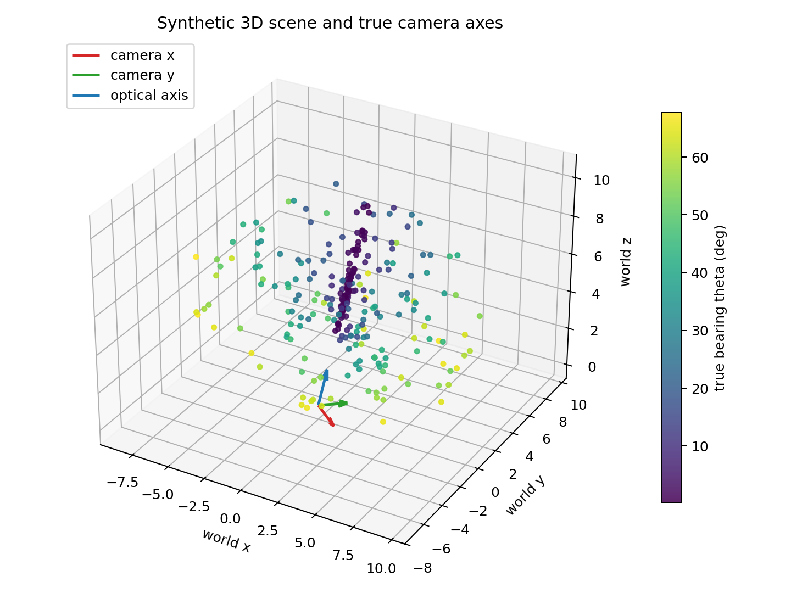

`scene_3d.png` visualizes the generated world points and the true camera axes. The point color is the true bearing angle `theta`, namely the angle between the optical axis and the ray from the camera center to the point.

Key reading:

- The blue camera axis is the optical axis used by the polar/bearing model.
- Points cover both near-axis rays and large off-axis rays, so the experiment contains both well-conditioned and near-singular angular measurements.
- This figure checks that the synthetic scene is not a tiny narrow-FOV case; it contains enough angular diversity to test polar residuals.

What it supports:

- The experiment is evaluating a bearing-space observation model, not merely a small-angle pinhole approximation.
- The presence of near-axis points motivates explicit handling of the `phi` singularity.

What it does not prove:

- It does not prove convergence advantage by itself; it only documents the geometry being tested.

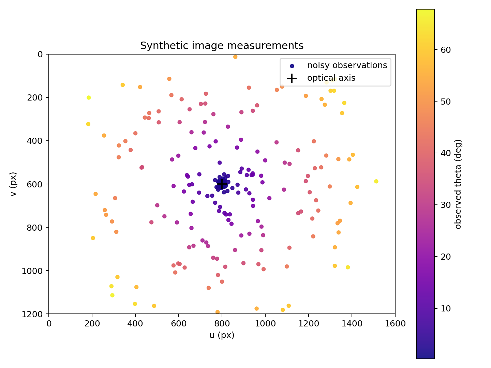

`image_measurements.png` shows the noisy image-plane observations generated by the equidistant camera model. The black cross is the optical-axis projection. The color again encodes observed `theta`.

Key reading:

- In an equidistant camera, image radius is approximately `r = f * theta`, so points farther from the cross have larger `theta`.
- Pixel noise is injected in `u, v`, then transformed into polar/bearing observations.
- Near the optical axis, many pixels have very small radius. Their radial angle `theta` remains meaningful, but their azimuth `phi` is poorly defined.

What it supports:

- It connects the conventional UV observation space to the proposed polar observation space.
- It explains why covariance propagation is necessary: uniform pixel noise does not become uniform `[theta, phi]` noise.

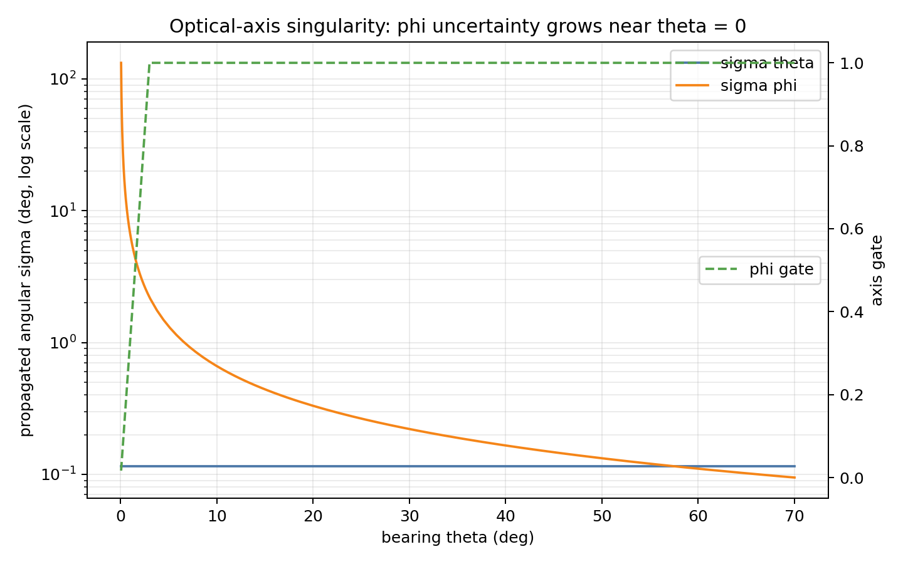

`axis_singularity.png` is the most important diagnostic figure for the covariance-aware residual. It plots the propagated angular uncertainty from isotropic pixel noise into `theta` and `phi`.

Key reading:

- `sigma_theta` stays relatively stable because the radial bearing angle is well-defined even near the center.
- `sigma_phi` grows rapidly as `theta -> 0`, because azimuth around the optical axis becomes physically ambiguous.
- The green dashed gate suppresses `phi` information near the optical axis instead of pretending that the angle is reliable.

What it supports:

- A raw polar residual is statistically wrong near the optical axis.
- The `phi` residual must be wrapped and down-weighted or removed when `theta` is too small.
- This is not only an implementation trick; it follows from the observation geometry.

Practical consequence:

```text
near optical axis: use theta strongly, use phi weakly or not at all
away from axis: use both theta and phi
```

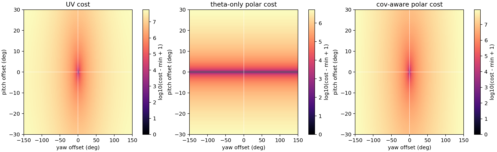

`cost_landscape.png` is the original pitch-yaw slice, also saved as `cost_landscape_pitch_yaw.png`. It compares cost surfaces over pitch and optical-axis yaw offsets. The three panels show UV cost, theta-only polar cost, and covariance-aware polar cost.

Key reading:

- The theta-only panel should be read as a tilt diagnostic. Because this project's `yaw` is optical-axis rotation, changing yaw has little direct effect on `theta`.
- The full polar cost combines radial `theta` information with azimuthal `phi` information, so it localizes the true solution in both tilt and optical-axis yaw.
- The UV cost is a valid baseline, but it does not expose the radial/angular information structure as explicitly.

What it supports:

- The proposed staged story is geometrically plausible: estimate tilt using the radial/bearing angle first, then estimate optical-axis yaw using azimuth.
- The staged method is not claiming new visual information; it reorganizes existing information into better-conditioned subproblems.

Important caution:

- This plot depends on the project's optical-axis yaw convention. If yaw is a world-frame heading, the theta-only surface would not have the same interpretation.

The same three cost types are now also drawn for the other two tilt slices:

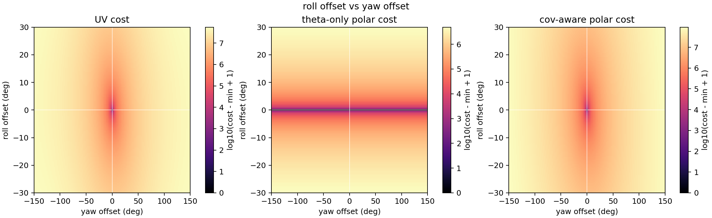

`cost_landscape_roll_yaw.png` holds pitch fixed and scans roll versus optical-axis yaw. This is the closest sibling of the original plot, but it shows that the same theta/phi logic is not tied to the pitch axis specifically.

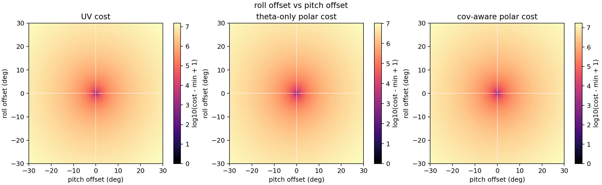

`cost_landscape_roll_pitch.png` holds yaw fixed and scans the two tilt axes together. This is the most direct check that the roll-pitch subspace behaves like a tilt plane, while yaw remains the separate in-plane rotation.

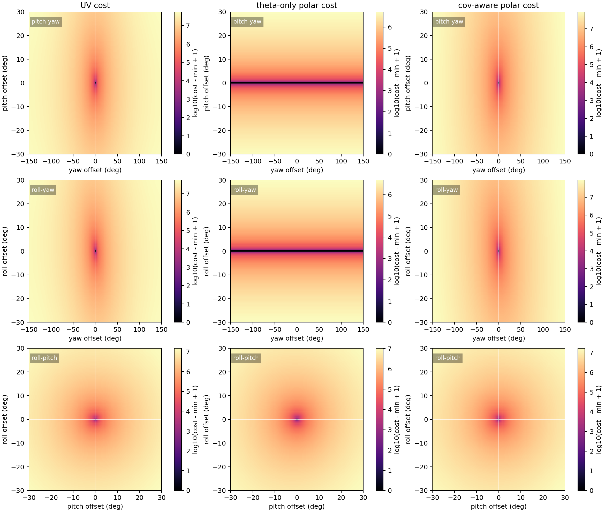

`cost_landscape_all_slices.png` arranges all nine panels together: three cost types times three coordinate slices. This is the most complete visualization for the observation model.

What the three slices together support:

- `pitch-yaw` and `roll-yaw` show that both tilt axes decouple differently from the optical-axis yaw, but neither breaks the basic staged story.
- `roll-pitch` shows the pure tilt plane, where the residual landscape should still be well-behaved near the truth.
- The three slices jointly support the claim that the decomposition is geometric, not an artifact of one special axis choice.

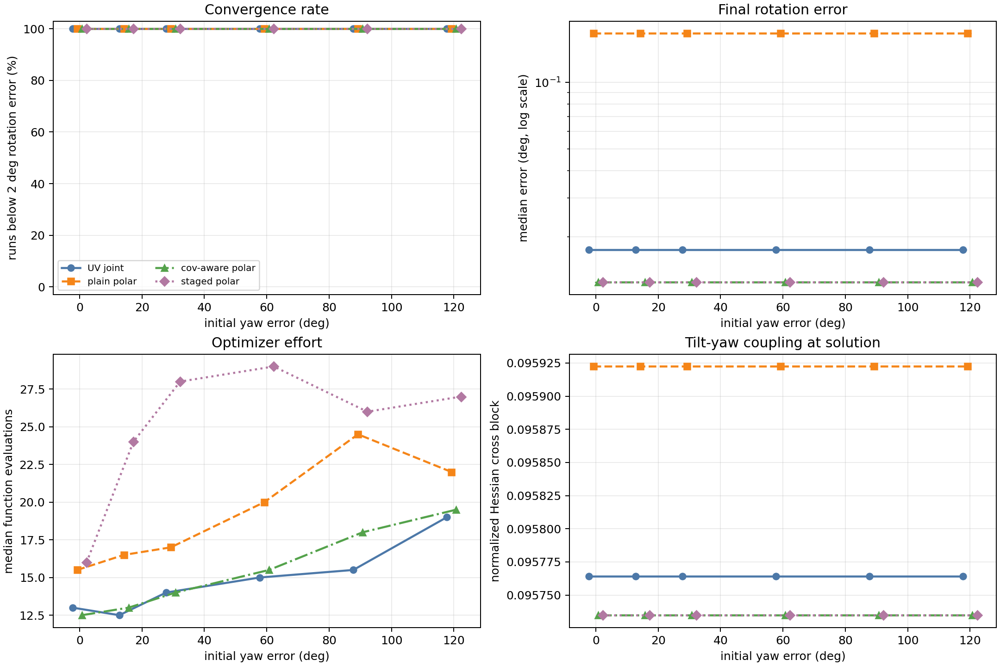

`monte_carlo_summary.png` summarizes the clean single-view Monte-Carlo experiment. In the default run, it aggregates 10 randomized trials per yaw-error level, 6 yaw-error levels, and therefore 60 runs per method. With 4 methods, the CSV contains 240 result records.

This is how the figure reflects Monte-Carlo sampling:

- The x-axis lists the controlled initial optical-axis `yaw` error levels.
- For each x value, the experiment repeats the same method under 10 randomized initial perturbations.
- A plotted marker is not one run; it is a statistic over those repeated trials.
- Median curves summarize the central tendency, and vertical bars show the 25th-75th percentile range when that subplot uses error bars.

Visual note:

- Several curves are numerically identical or extremely close in this clean experiment.
- To avoid hiding one method behind another, the plotted x positions are shifted by a tiny method-specific visual offset.
- The true x variable is still the initialization error of the project-specific optical-axis `yaw`; the offset is only for readability.

Subplot reading:

- **Top-left: Convergence rate**. This reports the percentage of trials whose final rotation error is below 2 degrees. In the current clean single-view setup, all methods reach 100% across all initial yaw errors, so the curves naturally overlap. This means the problem is too easy to separate convergence basins.
- **Top-right: Final rotation error**. This reports the median final rotation error on a log scale. `polar_cov_joint` and `polar_staged` nearly overlap because the staged initializer and direct covariance-aware polar optimization reach the same optimum in this low-dimensional pose-only case. `polar_plain_joint` is worse, showing that raw polar weighting is statistically weaker.
- **Bottom-left: Optimizer effort**. This reports median function evaluations. `polar_staged` usually costs more evaluations because it runs theta initialization, phi initialization, and final joint refinement. In this easy setting, the extra stages do not buy a convergence-rate improvement.
- **Bottom-right: Tilt-yaw coupling at solution**. This reports a normalized Hessian cross-block between the roll/pitch tilt variables and the optical-axis yaw variable. Smaller values mean the estimated solution has weaker local tilt-yaw coupling. In this clean setup, methods are close because they all converge to nearly the same local geometry.

Key conclusion:

- All methods converge in this clean 3-DOF pose-only setup.
- `polar_plain_joint` has a larger final error because raw `[theta, phi]` weighting ignores the actual covariance induced by pixel noise.
- `polar_cov_joint` slightly improves the final error compared with UV, while `polar_staged` reaches the same final accuracy but uses more function evaluations.

What it supports:

- Covariance-aware polar residuals are numerically meaningful.
- Raw polar residuals should not be used as the main scientific baseline.

What it does not support:

- It does not prove that staged optimization is superior. The single-view pose-only problem is too clean and too low-dimensional to expose the convergence-basin advantage.

## Experiment 2: Two-View Inverse-Depth BA Stress Test

Run:

```powershell
python run_ba_experiment.py
```

Configuration:

| Setting | Value |
|---|---:|
| Camera model | equidistant projection |
| Image size | 1600 x 1200 |
| Focal length | 620 px |
| Pixel noise sigma | 1.25 px |
| Points | 72 |
| True RPY | `(9, -14, 31)` deg |
| Second camera center | `(0.85, -0.18, 0.16)` |
| Depth range | 4 m to 13 m |
| Outlier fraction | 6% shuffled matches |
| Yaw initialization errors | `0, 30, 60, 100, 140, 170` deg |
| Tilt initialization error | 24 deg |
| Log inverse-depth noise sigma | 0.65 |
| Trials per level | 6 |
| Output directory | `outputs_ba/` |

Optimized state:

```text
x = [roll, pitch, yaw, log_inv_depth_1, ..., log_inv_depth_N]
```

Methods:

| Method | Description |
|---|---|
| `ba_uv_joint` | joint inverse-depth BA using UV residual |
| `ba_polar_plain_joint` | joint inverse-depth BA using raw polar residual |
| `ba_polar_cov_joint` | joint inverse-depth BA using covariance-aware polar residual |
| `ba_polar_staged` | fixed-depth theta tilt initialization, phi yaw initialization, final joint inverse-depth BA |

Convergence criterion:

```text
rotation error < 3 deg
and inlier depth relative RMSE < 45%
```

Outliers participate in optimization. Depth RMSE is evaluated on inliers only, because shuffled matches have no recoverable depth correspondence.

Results:

| Method | Convergence | Median rotation error | Median inlier depth RMSE | Median function evals |
|---|---:|---:|---:|---:|
| `ba_uv_joint` | 0.0% | 53.5951 deg | 5.027 | 90.0 |
| `ba_polar_plain_joint` | 0.0% | 30.0168 deg | 3.299 | 90.0 |
| `ba_polar_cov_joint` | 0.0% | 31.1321 deg | 3.570 | 90.0 |
| `ba_polar_staged` | 100.0% | 0.6834 deg | 0.229 | 93.0 |

Per-yaw summary for `ba_polar_staged`:

| Initial yaw error | Convergence | Median rotation error | Median inlier depth RMSE |
|---:|---:|---:|---:|
| 0 deg | 100.0% | 0.433 deg | 0.204 |
| 30 deg | 100.0% | 0.710 deg | 0.310 |
| 60 deg | 100.0% | 0.969 deg | 0.287 |
| 100 deg | 100.0% | 0.576 deg | 0.182 |
| 140 deg | 100.0% | 0.489 deg | 0.166 |
| 170 deg | 100.0% | 0.879 deg | 0.260 |

Interpretation:

The stress test supports the larger story: the staged polar/bearing initialization substantially enlarges the convergence basin under depth-pose coupling, large yaw initialization error, and mild outlier contamination.

However, this is still synthetic evidence. A stronger paper-level claim should add more ablations, different camera motions, unknown translation, stronger outliers, and real datasets.

Visualization:

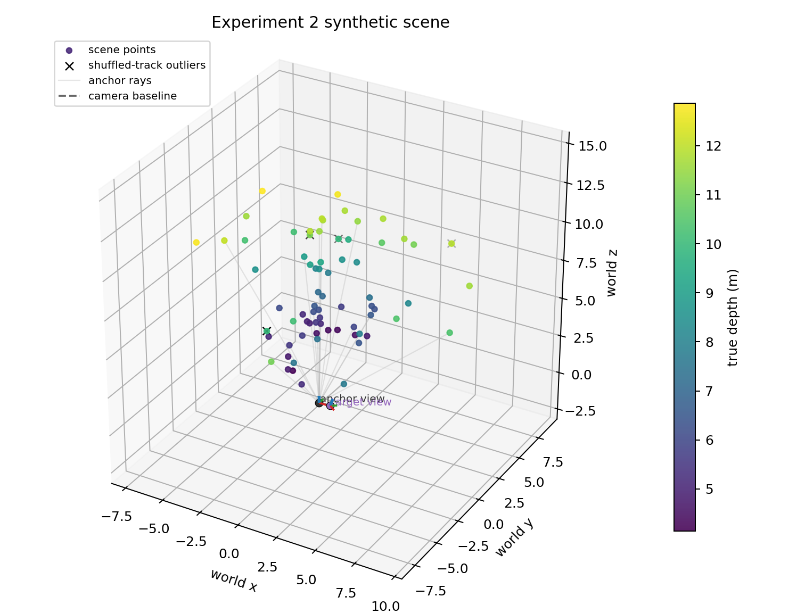

### Figure Interpretation

`ba_scene_3d.png` visualizes the two-view inverse-depth BA stress-test geometry. Points are colored by true depth, faint gray rays show the anchor-view inverse-depth anchoring, the red/green/blue axes are the camera `x/y/optical-axis` directions, and black `x` markers denote correspondences whose target-view measurements are shuffled into outliers.

Key reading:

- The anchor camera sits at the world origin, while the second camera provides a single off-axis baseline. So this is already a coupled pose-depth BA problem, but still with only one target view.
- The point cloud spans a broad depth range rather than a thin depth shell, which makes inverse-depth variables genuinely heterogeneous and able to interact strongly with pose.
- The anchor rays spread over both near-axis and off-axis regions, so the same theta/phi reliability story from Experiment 1 still matters inside BA instead of disappearing in a narrow-FOV corner case.
- Outlier-corrupted correspondences are sparse and spatially distributed, making the stress test mildly contaminated but not dominated by gross mismatch failure.

What it supports:

- The optimizer really is facing the intended inverse-depth BA coupling, not a trivial pose-only refinement.
- The staged method gets a fair chance to help because the scene contains both depth variation and angular variation.

What it does not prove:

- This figure alone does not explain which optimizer will converge; that evidence comes from the Monte-Carlo summary below.
- Translation is still known in Experiment 2, so this remains simpler than a real local BA window.

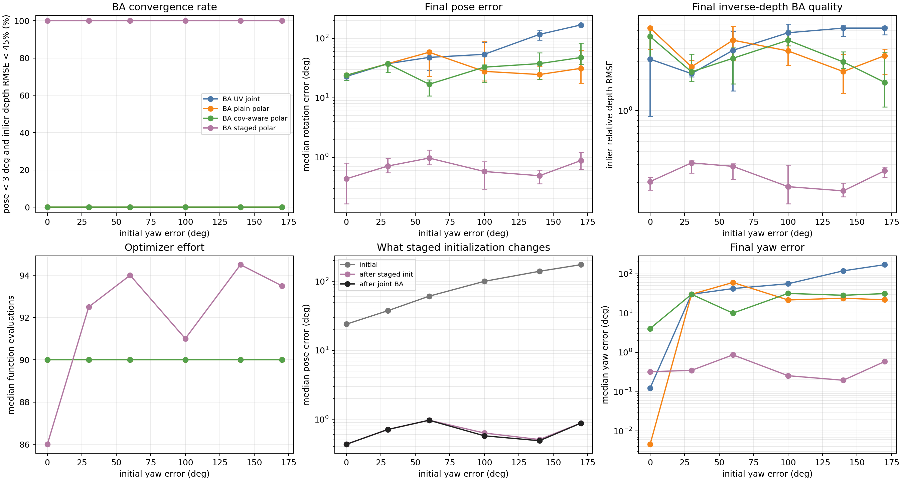

### Figure Interpretation

`ba_monte_carlo_summary.png` is the central evidence figure for the larger claim. Unlike the single-view sanity check, this experiment optimizes pose and inverse depths together, so pose-depth coupling can trap direct joint optimization.

In the default BA run, this figure aggregates 6 randomized trials per yaw-error level and 6 yaw-error levels, so each method has 36 runs. With 4 methods, `ba_monte_carlo_results.csv` contains 144 result records.

Key reading:

- The convergence-rate panel shows that direct joint BA with UV, raw polar, or covariance-aware polar residuals fails under the tested large-initial-error regime.
- The final-pose-error panel shows that `ba_polar_staged` stays below roughly one degree median error across yaw initialization errors up to 170 degrees.
- The inlier-depth-RMSE panel shows that staged initialization also allows the later joint BA to recover reasonable depths for true correspondences.
- The optimizer-effort panel shows that staged BA is not free, but the extra effort buys a much larger convergence basin.
- The staged-initialization panel separates the role of initialization from final BA: most of the pose rescue happens before the final joint refinement.
- The final-yaw-error panel should be read as final **optical-axis yaw** error, not world heading error.

How to read the staged-initialization panel:

- `initial` is the pose error of the raw Monte-Carlo starting guess before any optimization.
- `after staged init` is the pose error after the two staged least-squares initialization steps but before the final joint BA. First, a `theta-only` solve updates `roll/pitch` while keeping yaw and all inverse depths fixed. Then a `phi-only` solve updates yaw while keeping the newly estimated `roll/pitch` and all inverse depths fixed.
- `after joint BA` is the final pose error after the subsequent full covariance-aware polar BA jointly refines pose and inverse depths.

Why the middle curve already drops:

- Those two staged steps are not just heuristics; they are real nonlinear least-squares optimizations on restricted subproblems.
- The `theta-only` stage improves tilt without letting depth variables absorb the pose error.
- The `phi-only` stage then improves optical-axis yaw after tilt has already been corrected.
- Because the hard pose-depth coupling is temporarily removed during staged initialization, the optimizer can often recover a much better pose before the final full BA begins.

What it supports:

- The larger story starts to hold in this synthetic stress test: theta/phi staged initialization can rescue a hard inverse-depth BA problem that direct joint optimization does not solve.
- The benefit is not merely from changing UV to polar residuals; `ba_polar_cov_joint` alone still fails in this setting. The staged structure is the important part.

Limitations:

- Translation is known.
- The scene and noise are synthetic.
- Outliers are mild and handled only by a robust loss, not by a full matching/outlier rejection pipeline.
- This is evidence for a research direction, not yet a complete VIO/SLAM claim.

## Experiment 3: Realistic Three-View Local BA

Run:

```powershell
python run_exp3_experiment.py
```

Motivation:

Experiment 2 already shows that staged theta/phi initialization can rescue a hard inverse-depth BA problem, but it still assumes the target-view translations are known. Experiment 3 makes the setup more realistic by jointly optimizing two later camera poses and all inverse depths, while keeping only the anchor view fixed.

This remains synthetic, but it adds several ingredients that move the problem closer to a real local BA window:

- a noisy anchor view instead of perfect anchor bearings;
- two later views instead of one;
- unknown translation components for both later poses;
- a weak baseline-length prior that resolves monocular scale without giving the optimizer the true translation direction;
- mild outliers in the later-view tracks.

Configuration:

| Setting | Value |
|---|---:|
| Camera model | equidistant projection |
| Image size | 1600 x 1200 |
| Focal length | 620 px |
| Anchor-view pixel noise sigma | 1.25 px |
| Target-view pixel noise sigma | 1.25 px |
| Points | 90 |
| Later camera poses | 2 |
| True RPYs | `(8, -13, 22)` deg and `(12, -9, 36)` deg |
| True camera centers | `(0.78, -0.18, 0.15)` and `(1.52, -0.34, 0.27)` |
| Outlier fraction | 6% shuffled tracks |
| Motion prior | baseline-length prior only |
| Baseline prior sigma | 0.10 m |
| Yaw initialization errors | `0, 30, 60, 100, 140, 170` deg |
| Tilt initialization error | 24 deg |
| Translation initialization error | 0.28 m |
| Log inverse-depth noise sigma | 0.55 |
| Trials per level | 6 |
| Output directory | `outputs_exp3/` |

Optimized state:

```text
x = [rpy_2, center_2, rpy_3, center_3, log_inv_depth_1, ..., log_inv_depth_N]
```

Methods:

| Method | Description |
|---|---|
| `ba_uv_joint` | direct multi-view BA using UV residuals |
| `ba_polar_plain_joint` | direct multi-view BA using raw polar residuals |
| `ba_polar_cov_joint` | direct multi-view BA using covariance-aware polar residuals |
| `ba_polar_staged` | staged theta/phi rotation initialization, then final joint multi-view BA |

Success criterion:

```text
max rotation error across the two optimized poses < 3 deg
and inlier depth relative RMSE < 45%
```

Translation error is still reported, but it is treated as a diagnostic rather than the success gate. The reason is important: Experiment 3 uses only weak baseline-length priors to anchor monocular scale, so translation direction remains much less directly constrained than rotation and depth.

Results:

| Method | Convergence | Median pose error | Median translation error | Median inlier depth RMSE | Median function evals |
|---|---:|---:|---:|---:|---:|
| `ba_uv_joint` | 0.0% | 68.980 deg | 0.280 m | 3.880 | 120.0 |
| `ba_polar_plain_joint` | 0.0% | 46.314 deg | 0.280 m | 2.828 | 120.0 |
| `ba_polar_cov_joint` | 0.0% | 37.943 deg | 0.280 m | 2.440 | 120.0 |
| `ba_polar_staged` | 83.3% | 1.819 deg | 0.280 m | 0.315 | 115.5 |

Per-yaw summary for `ba_polar_staged`:

| Initial yaw error | Convergence | Median pose error | Median translation error | Median inlier depth RMSE |
|---:|---:|---:|---:|---:|
| 0 deg | 83.3% | 1.630 deg | 0.280 m | 0.370 |
| 30 deg | 83.3% | 2.114 deg | 0.280 m | 0.291 |
| 60 deg | 100.0% | 1.505 deg | 0.280 m | 0.273 |
| 100 deg | 100.0% | 1.867 deg | 0.280 m | 0.323 |
| 140 deg | 66.7% | 1.809 deg | 0.280 m | 0.329 |
| 170 deg | 66.7% | 2.059 deg | 0.280 m | 0.285 |

Interpretation:

Experiment 3 keeps the central staged-initialization story alive in a more realistic local BA problem. Once noisy anchor bearings, multiple later views, unknown translation components, and weak scale priors are added, the direct joint methods still collapse into very poor pose/depth solutions, while staged polar initialization continues to drive the optimizer into a good rotation-depth basin in most trials.

At the same time, this experiment also exposes a real limitation instead of hiding it: the weak baseline-length priors are enough to prevent total scale drift, but they do not make translation direction as recoverable as rotation. So the translation-error panel should be read as a diagnostic of how weakly constrained that part of the problem still is, not as the main evidence for or against the staged story.

Visualization:

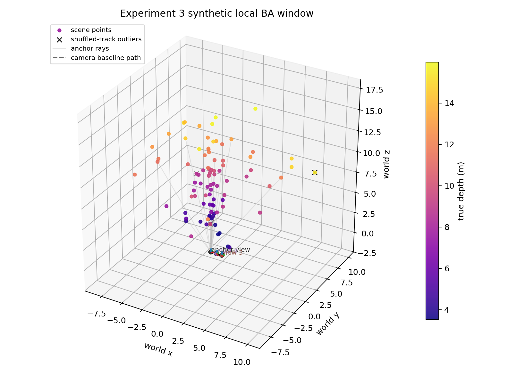

### Figure Interpretation

`exp3_scene_3d.png` shows the synthetic local BA window used in Experiment 3. Points are colored by true depth, the dashed polyline connects the anchor view and the two later camera centers, the red/green/blue axes denote each camera's `x/y/optical-axis` directions, and black `x` markers identify tracks whose later-view observations are shuffled into outliers.

Key reading:

- Compared with Experiment 2, the scene now contains two later poses instead of one, so each landmark participates in a short multi-view window rather than a single target-view match.
- The camera path is short and roughly forward-looking, which is realistic for a local BA window but also explains why translation direction remains much weaker than rotation.
- The point cloud still spans a wide depth range and broad bearing angles, so the staged theta/phi story is tested together with more realistic pose-depth-scale coupling instead of being isolated in a tiny toy geometry.
- Mild track outliers are present across the later views, so the final BA still has to operate under imperfect correspondences.

What it supports:

- Experiment 3 is geometrically closer to the README's intended local-BA story: noisy measurements, multiple later views, and unknown translations all coexist in one window.
- The scene is challenging without being pathological; it looks like a short monocular window, not an artificial pure-rotation case.

What it does not prove:

- The plot does not directly show anchor-view noise or weak baseline-length priors; those enter through the measurement model and optimization.
- It still does not make translation direction well observed, which is why the translation metric remains diagnostic.

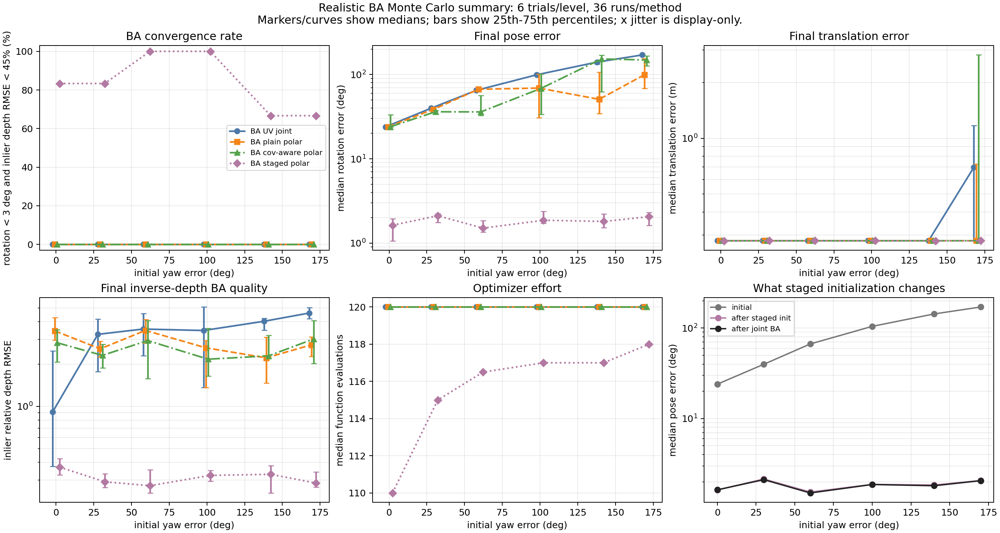

### Figure Interpretation

`exp3_monte_carlo_summary.png` summarizes 6 randomized trials per yaw-error level and 6 yaw-error levels, so each method has 36 runs.

Key reading:

- The convergence-rate panel shows a clear separation again: the three direct joint methods stay at 0%, while `ba_polar_staged` reaches 83.3% overall under the stated rotation-depth criterion.
- The final-pose-error panel shows that the direct joint methods still end in large-error basins, whereas the staged method stays around 2 degrees median pose error even under very large yaw initialization error.
- The final-translation-error panel should be read carefully. It stays near the initialization scale because Experiment 3 only constrains baseline lengths weakly; this panel is therefore a realism diagnostic, not the main success signal.
- The inverse-depth-RMSE panel shows the same story as the pose panel: staged initialization is what lets the later joint BA recover usable structure.
- The optimizer-effort panel shows that the staged method is slightly cheaper than exhausting the full iteration budget in the direct joint methods, because it reaches a workable basin before the final BA.
- The staged-initialization panel is the most direct explanation of why the method works here: the median initial pose error is about 84.6 degrees, the staged rotation-only initialization drops it to about 1.84 degrees, and the final joint BA then keeps that good basin rather than discovering it from scratch.

What it supports:

- The staged theta/phi idea is not limited to the simplest two-view, known-translation BA stress test.
- The main benefit still comes from reorganizing the rotation search before full BA, not merely from swapping UV residuals for polar residuals.
- The story remains visible even when anchor observations are noisy and later-view translations are no longer fixed.

What it does not support:

- It does not prove that translation is solved. Experiment 3 only uses weak baseline-length priors, and translation direction remains much less observable than rotation.
- It still does not prove real-data superiority or full monocular free-scale SLAM robustness.

## Experiment 4: Free-XYZ Multi-Track BA in Local and Global Regimes

Run:

```powershell
python run_exp4_experiment.py
```

Motivation:

Experiment 2 and 3 already show that staged theta/phi initialization can rescue difficult inverse-depth BA problems. But both still rely on anchor-based depth parameterizations. Experiment 4 asks a harder question: does the story survive when landmarks are optimized as free `XYZ` variables and many tracks are jointly refined with camera pose?

This experiment therefore shifts the story from a narrower **pose-depth coupling** claim to a broader **pose-structure coupling** claim.

Design:

- the first two views are fixed to remove monocular gauge freedom;
- all later camera poses and all 3D landmarks are optimized jointly;
- landmarks are free `XYZ` variables in world coordinates;
- initial landmarks are triangulated only from the first two fixed reference views;
- two geometric regimes are compared: a short-window `local BA` regime and a longer-path `global BA` regime;
- the camera trajectories now use wider, more realistic forward motion and are visualized as frustums;
- the observation graph is no longer full-visibility: later-view tracks can terminate early, and explicit occluder boxes remove some observations along the line of sight.

Optimized state:

```text
x = [optimized pose rotations, optimized pose centers, point_1_xyz, ..., point_N_xyz]
```

Methods:

| Method | Description |
|---|---|
| `xyz_uv_joint` | direct free-XYZ joint BA in UV residual space |
| `xyz_polar_cov_joint` | direct free-XYZ joint BA with covariance-aware polar residuals |
| `xyz_polar_staged` | theta-only roll/pitch initialization, phi-only yaw initialization, then final covariance-aware joint BA |

Success criterion:

```text
max rotation error across optimized poses < 3 deg
and structure relative RMSE < 30%
```

The structure threshold is deliberately looser than in the inverse-depth experiments, because a sparsified free-`XYZ` BA problem is much less directly constrained than an anchored inverse-depth one.

### Local BA Regime

Configuration:

| Setting | Value |
|---|---:|
| Views | 5 |
| Fixed reference views | 2 |
| Optimized later views | 3 |
| Points | 120 |
| Observations | 439 |
| Median track length | 4 |
| Track histogram | `{3: 59, 4: 43, 5: 18}` |
| Gap histogram | `{0: 112, 1: 8}` |
| Gapful points | `8 / 120` |
| Path length | 3.859 m |
| Scene scale | 27.029 m |
| Yaw initialization errors | `0, 30, 60, 100, 140` deg |
| Trials per level | 4 |
| Output files | `exp4_local_*` |

Results:

| Method | Convergence | Median pose error | Median translation error | Median structure rel. RMSE | Median function evals |
|---|---:|---:|---:|---:|---:|
| `xyz_uv_joint` | 30.0% | 26.740 deg | 3.845 m | 0.155 | 20.0 |
| `xyz_polar_cov_joint` | 25.0% | 49.263 deg | 9.052 m | 0.155 | 28.5 |
| `xyz_polar_staged` | 100.0% | 0.219 deg | 0.113 m | 0.124 | 147.5 |

Visualization:


`exp4_local_scene_3d.png` now shows a more BA-like local window: the camera centers are visibly separated, each camera is rendered as a frustum, and two translucent amber boxes act as synthetic occluders. Landmark color encodes track length rather than depth, so the variable-length observation graph is visible directly in 3D.

Key reading:

- The first two views are fixed reference views, while the later three are optimized.
- Most local tracks now survive only `3` or `4` views instead of all `5`.
- The short camera path still makes free-`XYZ` structure weaker than in the global regime.
- This is the regime where pose-structure coupling is still strong enough that a bad initialization can send joint BA into a wrong basin.


`exp4_local_summary.png` is best read as a basin-rescue figure.

Key reading:

- `xyz_polar_staged` converges in all tested trials, while the direct joint methods frequently fail under large yaw initialization error.
- The staged-initialization panel shows that most of the gain still happens before full BA: the staged rotation-only initialization reduces roughly `18-142` degree initial pose error to about `0.50-0.63` degrees.
- Even after pose rescue, the sparser observation graph makes final structure quality worse than the full-visibility version, with median relative RMSE around `0.124`.

What it supports:

- In local BA, the staged story is still mainly about **preventing pose-structure coupling from sending joint BA into a bad basin**.
- The method is not relying on a perfect full-track graph; it still works when tracks terminate early and a small fraction contain gaps.

### Global BA Regime

Configuration:

| Setting | Value |
|---|---:|
| Views | 8 |
| Fixed reference views | 2 |
| Optimized later views | 6 |
| Points | 160 |
| Observations | 954 |
| Median track length | 6 |
| Track histogram | `{5: 54, 6: 67, 7: 30, 8: 9}` |
| Gap histogram | `{0: 121, 1: 1, 2: 28, 3: 10}` |
| Gapful points | `39 / 160` |
| Path length | 9.792 m |
| Scene scale | 40.951 m |
| Yaw initialization errors | `0, 30, 60, 100, 140` deg |
| Trials per level | 4 |
| Output files | `exp4_global_*` |

Results:

| Method | Convergence | Median pose error | Median translation error | Median structure rel. RMSE | Median function evals |
|---|---:|---:|---:|---:|---:|
| `xyz_uv_joint` | 20.0% | 11.648 deg | 3.682 m | 0.095 | 150.0 |
| `xyz_polar_cov_joint` | 5.0% | 54.996 deg | 11.149 m | 0.122 | 22.5 |
| `xyz_polar_staged` | 100.0% | 0.260 deg | 0.233 m | 0.081 | 156.0 |

Visualization:


`exp4_global_scene_3d.png` shows a longer forward trajectory, purple optimized-view frustums, fixed gray reference frustums, and three translucent occluders that create structured observation loss. The point colors again encode track length, so the global regime's broader but still incomplete track support is visible directly.

Key reading:

- Compared with local BA, the path is longer and the tracks still span more views, but most no longer survive the full `8`-view window.
- The larger baseline creates stronger parallax and more geometric redundancy.
- Once pose is in a good basin, this geometry still gives BA more leverage than the local regime to refine free-`XYZ` structure and translation.


`exp4_global_summary.png` should be read as both a basin-rescue figure and a post-rescue refinement figure.

Key reading:

- `xyz_polar_staged` again reaches 100% convergence under the tested large-initial-error regime.
- The staged-initialization panel shows the same early rescue effect under the sparser track graph: the staged pose initialization reduces roughly `18-142` degree initial pose error to about `0.48-0.54` degrees before final BA.
- The direct joint methods become even less reliable than in the full-visibility version, but the staged method still reaches median structure relative RMSE around `0.081`.

What it supports:

- The staged initialization story is not limited to short local BA windows or unrealistically complete track graphs.
- In a larger multi-view BA, the same pose rescue still unlocks better structure and translation refinement once enough geometry is present.

### Local vs Global Difference

The most important difference is **not** whether staged initialization works. In this experiment, it works in both regimes.

The real difference is what the geometry and track graph can do **after** the pose basin has been fixed:

- In `local BA`, the main win is still basin rescue. With track dropout and mild occlusion, the final structure stays noticeably noisier, at about `0.124` relative RMSE even after pose is corrected.
- In `global BA`, the staged method still matters at initialization, but the larger path and broader support let the optimizer convert that pose win into a better structure result, around `0.081` relative RMSE.

So the current evidence does **not** support the claim that the story is only a local-BA story. A more defensible reading is:

- staged theta/phi initialization is a poor-initialization rescue mechanism for joint BA;
- that rescue mechanism appears in both local and global synthetic BA, even when the track graph is sparse and imperfect;
- global BA benefits more strongly from extra view redundancy once pose has already been rescued.

## Experiment 5: UAV-Style Oblique Multi-Strip Free-XYZ BA

Run:

```powershell
python run_exp5_experiment.py
```

Motivation:

Experiment 4 already made the free-`XYZ` BA story much more realistic, but it still used a single forward path. Experiment 5 asks a more aerial-photogrammetry-like question: if the cameras fly several oblique strips with stronger strip-to-strip pose diversity, track gaps, and structured occlusion, does the staged `theta/phi` story still hold?

Design:

- `3` strips: west / center / east;
- `12` total views, with `2` fixed center-strip anchors and `10` optimized views;
- `180` free-`XYZ` landmarks arranged in several spatial clusters;
- explicit occluder boxes that remove some later observations;
- track dropout and interior gaps, so the block is not full-visibility;
- inward-looking oblique viewing directions instead of a single nearly forward path.

Important geometry note:

To keep the true poses physically reasonable under this project's `R = Rz(yaw) Ry(pitch) Rx(roll)` convention, the internal Exp5 world uses positive `z` as "downward depth" and the 3D scene figure inverts the `z` axis for visualization. This avoids artificial near-`180 deg` roll/pitch ground-truth poses while still drawing the scene like an airborne block.

The staged solver in this experiment also uses `2` alternating `theta-only / phi-only` cycles before the final covariance-aware joint BA, and its final refinement is run dense rather than with the Exp4 sparse finite-difference pattern. The method is still the same staged story; these details simply make the larger strip-block numerically stable enough to test that story fairly.

Configuration:

| Setting | Value |
|---|---:|
| Strips | 3 |
| Views | 12 |
| Fixed reference views | 2 |
| Optimized later views | 10 |
| Points | 180 |
| Observations | 1200 |
| Scene scale | 27.652 m |
| Track histogram | `{4: 8, 5: 31, 6: 51, 7: 36, 8: 35, 9: 15, 10: 4}` |
| Gap histogram | `{0: 35, 1: 52, 2: 60, 3: 29, 4: 4}` |
| Gapful points | `145 / 180` |
| True roll range | `-40.7 deg` to `41.3 deg` |
| True pitch range | `-13.3 deg` to `13.4 deg` |
| True yaw range | `-10.5 deg` to `18.7 deg` |
| Yaw initialization errors | `0, 30, 60, 100, 140` deg |
| Tilt initialization error | `22 deg` |
| Translation initialization error | `0.70 m` |
| Trials per level | 3 |
| Output files | `exp5_uav_oblique_*` |

Results:

| Method | Convergence | Median pose error | Median translation error | Median structure rel. RMSE | Median function evals |
|---|---:|---:|---:|---:|---:|
| `xyz_uv_joint` | `0.0%` | `68.381 deg` | `10.804 m` | `0.0047` | `23.0` |
| `xyz_polar_cov_joint` | `0.0%` | `78.706 deg` | `28.774 m` | `0.0047` | `24.0` |
| `xyz_polar_staged` | `100.0%` | `0.554 deg` | `0.306 m` | `0.0020` | `101.0` |

Visualization:


`exp5_uav_oblique_scene_3d.png` shows the airborne block in 3D: three strips, fixed black center-strip anchors, optimized oblique frustums, several landmark clusters, and translucent amber occluders. Landmark color encodes track length, so the sparse and gapful observation graph is visible directly.

Key reading:

- This looks much closer to an actual oblique UAV acquisition than Exp4's single path.
- The center strip provides the two fixed anchor views used to triangulate the initial landmarks.
- The west and east strips look inward across the block, so the scene contains stronger strip-to-strip orientation diversity than the earlier free-`XYZ` experiments.
- Most tracks are incomplete, and many contain interior gaps, so the staged story is no longer being tested on a cosmetically dense graph.


`exp5_uav_oblique_plan_view.png` makes the strip layout easier to read from above. The projected optical-axis arrows show that the three strips are not just translated copies of one another; they create an inward-looking oblique block.


`exp5_uav_oblique_summary.png` should again be read as a basin-rescue figure.

Key reading:

- Both direct joint methods stay at `0%` convergence under the tested initialization errors.
- `xyz_polar_staged` reaches `100%` convergence across all tested yaw-error levels.
- The staged-initialization panel shows the same mechanism as before: the median initial pose error is roughly `22-146 deg`, staged initialization reduces it to about `1.3-1.8 deg`, and the final joint BA then refines it further to about `0.55 deg`.
- The structure panel shows that even though all methods can keep a small relative `XYZ` RMSE under the fixed-anchor setup, only the staged method simultaneously recovers the pose basin.
- The translation panel shows the same separation as the pose panel: once the pose basin is rescued, the final BA can also keep the optimized camera centers close to the truth.

What it supports:

- The main story still holds in a more realistic oblique multi-strip airborne block.
- The benefit still comes from staged initialization, not merely from switching UV residuals to covariance-aware polar residuals.
- The story is now supported in a setting with multiple tracks, free pose plus free structure, structured occlusion, and strong track incompleteness.

What it does not prove:

- It still does not replace real aerial BA datasets.
- The first two views remain fixed, so the experiment is not a full free-gauge global reconstruction.
- The visibility, dropout, and occlusion patterns are still synthetic even if they are more realistic than earlier experiments.

## Current Claim

Supported:

- covariance-aware polar residual is better behaved than raw polar residual;
- `phi` must be wrapped and down-weighted near the optical axis;
- staged theta/phi initialization can dramatically improve difficult inverse-depth BA convergence in this synthetic setting.
- staged theta/phi initialization still improves a more realistic multi-view local BA problem with noisy anchor observations and unknown translation components.
- staged theta/phi initialization still improves a harder free-`XYZ` multi-track BA problem, where the story is better described as pose-structure coupling rather than only pose-depth coupling.
- under severe synthetic initialization error, the staged story appears in both local and global BA regimes; the global regime mainly differs by converting the rescued pose basin into stronger structure recovery.
- the same staged story survives after Experiment 4 is made more realistic with meter-scale camera spacing, frustum visualization, structured track dropout, and synthetic occluders.
- the same staged story also survives a more aerial-photogrammetry-like oblique multi-strip free-`XYZ` BA block with strong track incompleteness, inward-looking strip geometry, and larger pose diversity.

Not yet fully proven:

- superiority on real VIO / SLAM datasets;
- robustness when translation direction, scale, bias, or extrinsics are all simultaneously unknown without auxiliary priors;
- general advantage across camera models and motion patterns.
- necessity of the same staged machinery in a well-initialized, full-map global BA with strong external initialization or loop-closure support.
- robustness on real airborne oblique blocks where visibility, gross outliers, and calibration errors come from a full matching and reconstruction pipeline rather than a synthetic generator.

## Reproduce

```powershell
cd E:\zuo\projects\RPYPolarSynthetic
python run_experiment.py
python run_ba_experiment.py
python run_exp3_experiment.py
python run_exp4_experiment.py
python run_exp5_experiment.py
python -m compileall src run_experiment.py run_ba_experiment.py run_exp3_experiment.py run_exp4_experiment.py run_exp5_experiment.py
```

## Versioning

This project is intended to be versioned under:

```text
https://github.com/Polar-vision/RPYPolarSynthetic
```

Suggested version labels:

| Tag | Meaning |
|---|---|
| `v0.1.0-sanity` | single-view sanity-check implementation |
| `v0.2.0-ba-stress` | two-view inverse-depth BA stress-test implementation and analysis |
| `v0.2.1-figure-report` | detailed figure interpretation and project-specific RPY documentation |
| `v0.2.2-landscape-slices` | complete roll-pitch-yaw cost landscape slices with six additional panels |
| `v0.2.3-summary-readability` | Monte-Carlo subplot explanations and de-overlapped summary curves |
| `v0.2.4-monte-carlo-metadata` | explicit Monte-Carlo trial counts and aggregation metadata in summary figures |
| `v0.3.0-realistic-ba-window` | three-view local BA stress test with unknown translations and weak baseline-length priors |
| `v0.3.1-ba-scene-figures` | Experiment 2/3 scene visualizations, figure interpretation, and synchronized outputs |
| `v0.4.0-free-xyz-ba-regimes` | free-XYZ multi-track BA comparison between local and global regimes |
| `v0.4.1-readme-sync` | README synchronization for Experiment 4 figures, results, and local/global BA interpretation |
| `v0.4.2-exp4-scene-readability` | clearer Experiment 4 scene figures with de-cluttered camera markers and updated figure explanation |
| `v0.4.3-exp4-frustum-scenes-and-rerun` | Experiment 4 scene redesign with larger baselines, frustum cameras, rerun results, and updated analysis |
| `v0.4.4-exp4-track-dropout-occlusion` | Experiment 4 track-end dropout, structured occlusion, sparser track graphs, and synchronized README/results |
| `v0.5.0-exp5-uav-oblique-strips` | Experiment 5 UAV-style oblique multi-strip free-XYZ BA with new scene figures, plan-view layout, outputs, and analysis |
| `v0.5.1-readme-sync` | README synchronization for Experiment 5, updated reproducibility instructions, and repository version bookkeeping |
| `v0.5.2-why-polar-why-staged` | text-only README method-introduction chapter explaining the evolution from `uv_joint` to `polar_staged` and the staged BA logic |
| `v0.5.3-polar-staged-problem-statement` | README clarification of what problem `polar_staged` actually solves, separating residual design from optimization-basin rescue |
