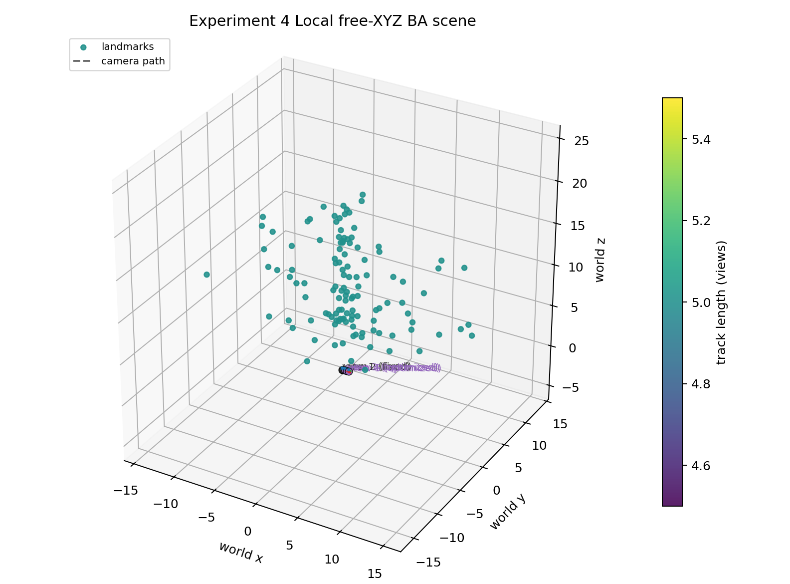
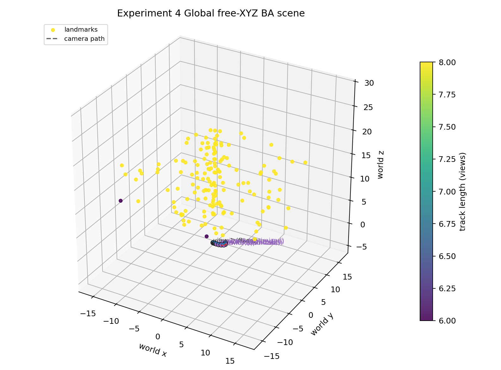
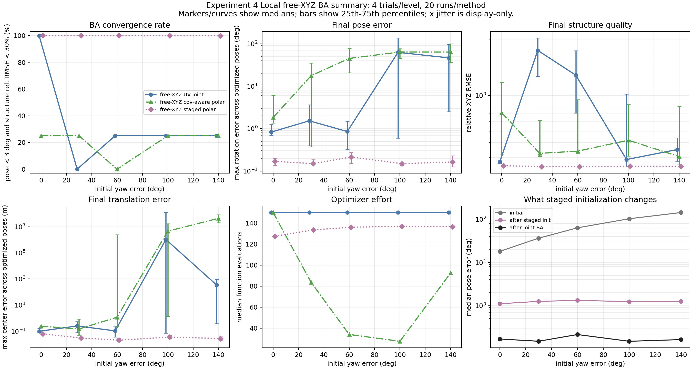
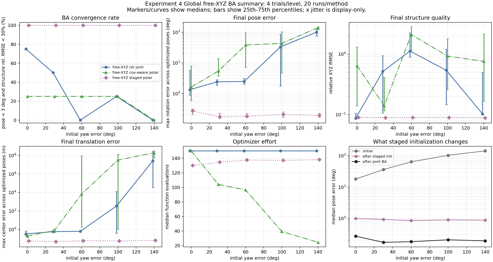

# v0.4.0-free-xyz-ba-regimes

## Request

Design a more realistic synthetic BA experiment with multiple tracks and joint `pose + structure` optimization, then test whether the staged polar story still holds and whether it is more a `local BA` story or a `global BA` story.

## Experiment Goal

Move beyond anchored inverse-depth landmarks and test the story under free `XYZ` structure:

- many landmark tracks instead of a single anchor-ray parameterization;
- joint optimization over camera poses and 3D point coordinates;
- separate `local` and `global` BA regimes;
- check whether staged theta/phi pose initialization still enlarges the convergence basin.

## Design

### State

For each run, the optimized state is:

```text
x = [optimized pose rotations, optimized pose centers, point_1_xyz, ..., point_N_xyz]
```

The first two views are fixed to remove monocular gauge freedom. All later views and all 3D points are optimized jointly.

### Structure Parameterization

- Landmarks are free `XYZ` variables in world coordinates.
- This is intentionally different from Experiment 2 and 3, which used anchor-based inverse depth.
- The experiment therefore tests a broader `pose-structure coupling` story instead of the earlier narrower `pose-depth coupling` story.

### Initialization

- Initial later-view poses are perturbed by large tilt, optical-axis yaw, and translation errors.
- Initial 3D points are triangulated only from the first two fixed views.
- This is meant to mimic a realistic BA situation with pre-existing reference keyframes or map points, rather than a completely unconstrained from-scratch reconstruction.

### Methods Compared

- `xyz_uv_joint`: direct free-XYZ joint BA in UV residual space.
- `xyz_polar_cov_joint`: direct free-XYZ joint BA with covariance-aware polar residuals.
- `xyz_polar_staged`: theta-only roll/pitch initialization, phi-only yaw initialization, then final covariance-aware joint BA.

### Regimes

#### Local BA

- views: `5`
- fixed views: `2`
- optimized views: `3`
- points: `120`
- observations: `600`
- median track length: `5`
- scene scale: `11.691 m`

This is a weak-parallax short window. It is still simplified because tracks are dense and long, but the total motion is small and the scene is comparatively harder for structure refinement.

#### Global BA

- views: `8`
- fixed views: `2`
- optimized views: `6`
- points: `160`
- observations: `1276`
- median track length: `8`
- track length range: `6` to `8`
- scene scale: `15.991 m`

This regime has more views and more geometric redundancy, so after a good pose basin is found, structure should be more recoverable than in the local window.

### Success Criterion

```text
max rotation error across optimized poses < 3 deg
and structure relative RMSE < 30%
```

The structure threshold is intentionally looser than the inverse-depth experiments, because free-XYZ local BA is much less directly constrained than the earlier anchored parameterizations.

## Verification

- `python -m compileall src run_exp4_experiment.py`
- `python run_exp4_experiment.py`

## Generated Outputs

- `outputs_exp4/exp4_local_results.csv`
- `outputs_exp4/exp4_local_scene_3d.png`
- `outputs_exp4/exp4_local_summary.png`
- `outputs_exp4/exp4_global_results.csv`
- `outputs_exp4/exp4_global_scene_3d.png`
- `outputs_exp4/exp4_global_summary.png`

## Figure Interpretation

### Local BA Scene



What this figure shows:

- The camera path is short, with only `5` views total and `3` optimized later views.
- All `120` landmarks are observed in every view, so tracks are dense and long, but the geometric baseline is still short.
- Landmark color encodes track length; in the local regime it is uniformly `5`, because every point remains inside the short window.
- The first two views are fixed, while the later three are optimized. This mimics a local BA window with an already established reference.

Why it matters:

- The short path means pose can be recovered, but free-`XYZ` structure is still weakly constrained compared with a larger window.
- This is exactly the situation where structure can absorb pose error if the optimizer starts from a bad basin.
- So this figure is the geometric reason the local regime is a good test of whether staged initialization can rescue joint BA.

### Global BA Scene



What this figure shows:

- The camera path is much longer, with `8` views total and `6` optimized later views.
- There are `160` landmarks and `1276` total observations.
- Track lengths range from `6` to `8`, so most points are seen across a broad part of the path.
- The longer path creates more parallax and more angular diversity than the local window.

Why it matters:

- Once pose is in a good basin, the global regime has enough multi-view redundancy to refine free-`XYZ` structure much better than the local regime.
- This figure visually explains why global BA is not "easier" at initialization, but is stronger at structure recovery after initialization has succeeded.

### Local BA Summary



How to read it:

- The convergence-rate panel shows the main result: `xyz_polar_staged` converges in all tested trials, while direct joint UV and direct joint cov-aware polar BA often fail under large initial yaw error.
- The final-pose-error panel shows that staged initialization consistently reaches a very low pose error, while direct cov-aware polar BA often gets trapped.
- The structure-quality panel is important: even after pose rescue, the local regime still leaves structure relatively weak, with median relative RMSE around `0.25`.
- The translation-error panel tells the same story: the staged method helps a lot, but the short window still limits how much geometric leverage BA has.
- The staged-initialization panel shows that most of the gain comes before full BA: staged pose initialization already collapses about `18-143 deg` initial pose error to about `1.1-1.3 deg`.

Interpretation:

- In local BA, the story is mainly about **basin rescue**.
- Staged initialization is what reliably gets the optimizer into a workable pose basin.
- Final structure remains only moderately accurate because the short window simply does not provide enough geometry to make free-`XYZ` recovery very tight.

### Global BA Summary



How to read it:

- The convergence-rate panel again shows a clear staged advantage: `xyz_polar_staged` reaches `100%` convergence in this experiment, while direct joint methods remain unreliable.
- The final-pose-error panel shows that staged initialization also stabilizes the harder global regime, despite the larger number of optimized poses and points.
- The structure-quality panel is where global BA differs most from local BA: once the pose basin is fixed, the larger window drives structure relative RMSE down to about `0.089`.
- The translation-error panel also improves sharply compared with local BA, because the longer path gives much stronger multi-view constraints.
- The staged-initialization panel shows that the pose rescue happens just as early here: staged initialization reduces about `18-142 deg` initial pose error to about `0.85-1.0 deg` before final BA.

Interpretation:

- In global BA, the story is both **basin rescue** and **post-rescue structure refinement**.
- The staged method still matters at initialization, but the larger difference from local BA is what happens afterwards: once pose is corrected, the richer geometry actually pays off.

## Local vs Global BA Difference

The clearest difference is not whether staged initialization works. It works in both.

The real difference is what the geometry can do after the pose basin has been fixed:

- `local BA` has a short baseline and limited parallax, so it benefits strongly from staged pose rescue, but structure recovery remains comparatively weak.
- `global BA` has many more views and much longer effective track support, so after staged pose rescue it can also recover structure and translation much more accurately.

In one sentence:

- `local BA` mainly tests whether staged initialization can stop pose-structure coupling from sending the optimizer into a bad basin.
- `global BA` tests the same basin issue, but also shows that once pose is rescued, broader multi-view redundancy turns that pose win into a much larger structure win.

## Results

### Overall Summary

#### Local BA

| Method | Convergence | Median pose error | Median translation error | Median structure rel. RMSE | Median function evals |
|---|---:|---:|---:|---:|---:|
| `xyz_uv_joint` | 35.0% | 1.085 deg | 0.137 m | 0.352 | 150.0 |
| `xyz_polar_cov_joint` | 20.0% | 31.050 deg | 0.254 m | 0.324 | 41.5 |
| `xyz_polar_staged` | 100.0% | 0.152 deg | 0.032 m | 0.252 | 135.0 |

#### Global BA

| Method | Convergence | Median pose error | Median translation error | Median structure rel. RMSE | Median function evals |
|---|---:|---:|---:|---:|---:|
| `xyz_uv_joint` | 30.0% | 2.733 deg | 0.671 m | 0.159 | 150.0 |
| `xyz_polar_cov_joint` | 20.0% | 16.794 deg | 1.462 m | 0.720 | 44.5 |
| `xyz_polar_staged` | 100.0% | 0.190 deg | 0.059 m | 0.089 | 136.0 |

### Staged Method by Initial Yaw Error

#### Local BA

| Initial yaw error | Convergence | Median initial pose error | Median staged pose error | Median final pose error | Median structure rel. RMSE |
|---:|---:|---:|---:|---:|---:|
| 0 deg | 100.0% | 17.99 deg | 1.10 deg | 0.17 deg | 0.255 |
| 30 deg | 100.0% | 36.31 deg | 1.26 deg | 0.15 deg | 0.251 |
| 60 deg | 100.0% | 63.15 deg | 1.32 deg | 0.21 deg | 0.250 |
| 100 deg | 100.0% | 102.56 deg | 1.24 deg | 0.15 deg | 0.252 |
| 140 deg | 100.0% | 142.59 deg | 1.26 deg | 0.16 deg | 0.252 |

#### Global BA

| Initial yaw error | Convergence | Median initial pose error | Median staged pose error | Median final pose error | Median structure rel. RMSE |
|---:|---:|---:|---:|---:|---:|
| 0 deg | 100.0% | 18.00 deg | 1.00 deg | 0.27 deg | 0.089 |
| 30 deg | 100.0% | 35.98 deg | 0.93 deg | 0.17 deg | 0.088 |
| 60 deg | 100.0% | 63.73 deg | 0.85 deg | 0.18 deg | 0.089 |
| 100 deg | 100.0% | 102.47 deg | 0.90 deg | 0.21 deg | 0.089 |
| 140 deg | 100.0% | 141.54 deg | 0.88 deg | 0.19 deg | 0.088 |

## Interpretation

### Main Finding

In this free-`XYZ`, multi-track experiment, the staged story still holds.

- Direct joint BA often lets structure and translation absorb pose error.
- A staged theta/phi pose initialization still moves the optimizer into a much better basin before full joint BA starts.
- This remains true even though the landmarks are no longer confined to anchor rays.

### Local vs Global

The current evidence suggests:

- the **basin-enlargement story** holds in both the tested `local BA` and `global BA` regimes;
- the **structure-recovery benefit after pose rescue** is much stronger in the `global BA` regime.

Why:

- In local BA, the staged method fixes pose very reliably, but the final free-XYZ structure remains relatively weak, with median relative RMSE around `0.252`.
- In global BA, the staged method also fixes pose very reliably, and the richer multi-view geometry then drives structure error down much further, to about `0.089`.

So the current experiment does **not** support the claim that the story is only local. It supports a more nuanced claim:

- staged initialization is useful in both regimes when initialization is poor;
- global BA benefits more strongly from extra view redundancy once the pose basin is corrected.

### Important Caveat

This experiment still stresses initialization aggressively:

- all optimized poses are perturbed by large yaw, tilt, and translation errors;
- only two views are fixed;
- the tested `global BA` is still a synthetic stress test, not a fully loop-closure-rich offline reconstruction with a strong pose-graph initializer.

Therefore the present result should be read as:

- staged polar initialization still helps in a harder free-XYZ BA problem;
- under these severe initial errors, the story survives in both local and global synthetic BA;
- it does **not yet** prove that a well-initialized, full-map global BA would need the same staged machinery as strongly.

## Selected Q&A

### Q1

Does this new experiment still test `pose-depth coupling`?

### A1

Not exactly. Because landmarks are now free `XYZ` variables, the cleaner term is `pose-structure coupling`.

- The earlier inverse-depth experiments constrained each point to an anchor ray.
- This experiment allows lateral structure motion as well.
- So it is testing a harder and more general coupling problem.

### Q2

What is the strongest conclusion from Experiment 4?

### A2

The staged pose-first idea is not limited to anchor-based inverse depth. It still helps when structure is free `XYZ` and many tracks are optimized jointly.

### Q3

Does Experiment 4 prove that the story is specifically a `global BA` story?

### A3

No.

- The staged method wins in both tested regimes.
- The more defensible reading is that staged initialization is a poor-initialization rescue mechanism for joint BA.
- The difference between `local` and `global` in this experiment is mainly how much structure quality improves after the pose basin is fixed.

## Limitations

- The local regime still has dense tracks and no occlusion/dropout pipeline, so it is not yet a production-like sliding window.
- The global regime still fixes the first two views, so it is not a fully free global similarity-gauge problem.
- Outlier rejection is not the focus here.
- The current global regime is stronger than local, but still not a full offline SfM benchmark.
