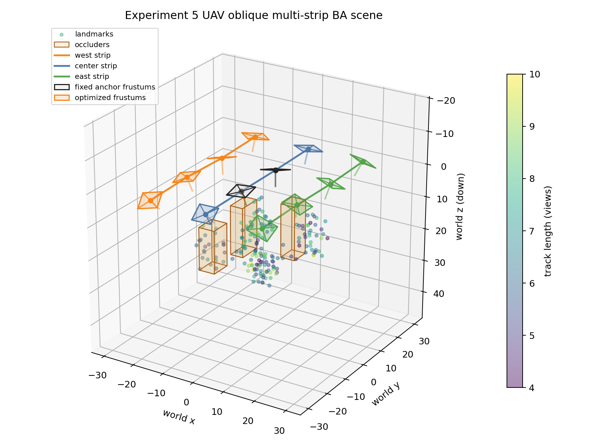
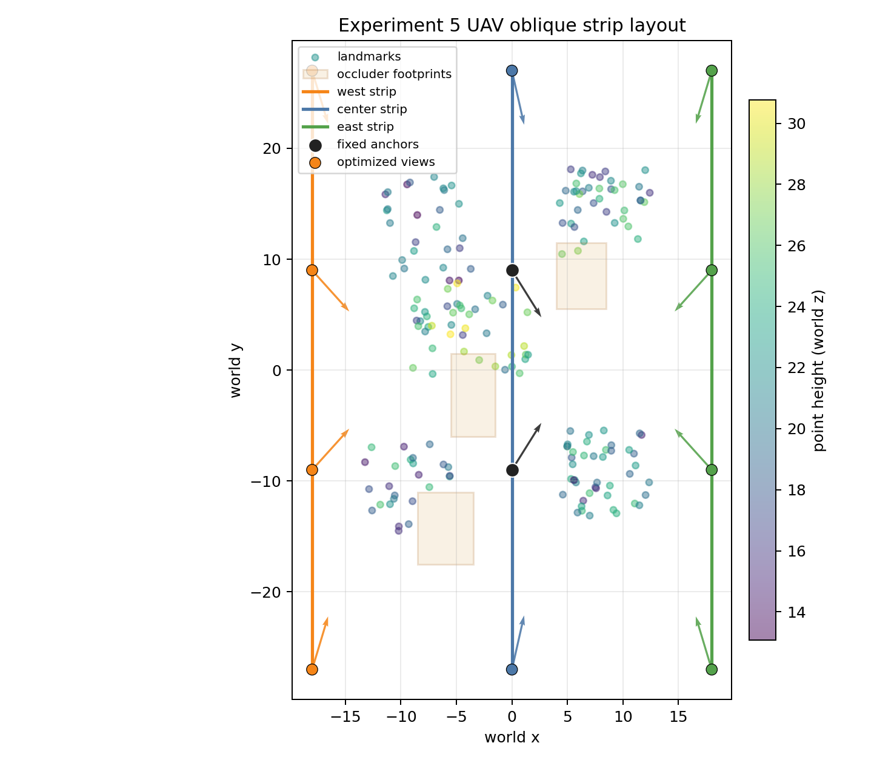
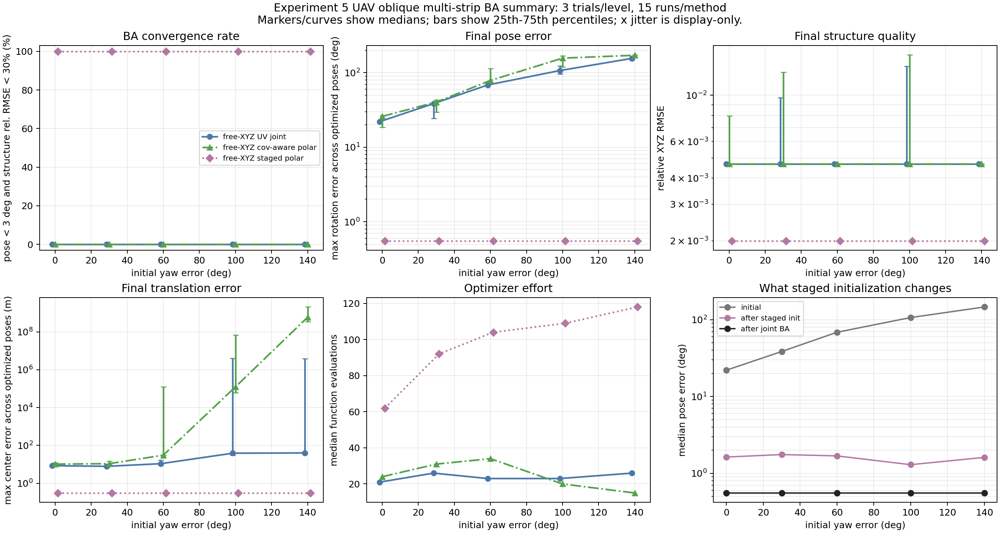

# v0.5.0-exp5-uav-oblique-strips

## Request

Design a new `Experiment 5` that mimics UAV oblique photogrammetry:

- fly several strips;
- allow somewhat larger pose differences between photos;
- keep the BA problem realistic enough to test whether the staged `theta/phi` story still holds.

## High-Level Design

This version introduces a new synthetic free-`XYZ` BA block with:

- `3` strips: west / center / east;
- `12` views total;
- `2` fixed anchor views from the center strip;
- `10` optimized views;
- `180` landmarks;
- explicit occluders;
- track dropout and interior gaps.

The two fixed center-strip anchors are still placed first so every point can be triangulated from a realistic overlapping pair before the rest of the block is optimized.

## Key Geometry Decision

The first Exp5 prototype failed for the wrong reason: the cameras were physically above the scene in a standard `z-up` world, so their optical axes pointed toward negative world `z`. Under this project's `R = Rz(yaw) Ry(pitch) Rx(roll)` convention, the optical axis depends only on `roll/pitch`, so "looking downward" forced true `roll/pitch` toward `±180 deg`.

That broke staged initialization before the real BA story could even be tested.

The fix in `v0.5.0` is:

- keep the scene visually UAV-like;
- but model the internal world with positive `z` pointing downward;
- and invert the `z` axis only in the 3D visualization.

This keeps the true optical axes physically reasonable for the optimizer while preserving an intuitive airborne figure.

True pose range after the redesign:

- `roll`: about `-40.7 deg` to `41.3 deg`
- `pitch`: about `-13.3 deg` to `13.4 deg`
- `yaw`: about `-10.5 deg` to `18.7 deg`

Median absolute true pose magnitudes:

- `|roll|`: `28.529 deg`
- `|pitch|`: `11.122 deg`
- `|yaw|`: `8.650 deg`

## Additional Exp5-Specific Numerical Choice

The released Exp5 runner (`run_exp5_experiment.py`) introduced two implementation choices:

1. repeat the staged `theta-only -> phi-only` cycle once before the final joint BA;
2. use a dense final covariance-aware polar refinement instead of reusing the Exp4 sparse finite-difference Jacobian pattern.

Important interpretation:

- this does **not** change the story into a different method;
- it is still the same staged `theta -> phi -> joint BA` idea;
- but the two choices are **not** equally important in the current released setup.

The later verification is:

- one staged cycle and two staged cycles both reproduce the same `100%` convergence under the released Exp5 default Monte-Carlo settings;
- switching the final joint BA back to the sparse Exp4 pattern drops staged convergence to about `86.7%` under those same settings.

So the more defensible reading is:

- the extra staged cycle is a conservative schedule choice;
- the more important numerical ingredient in the released Exp5 is the dense final refinement;
- and the first Exp5 failure was fixed primarily by the geometry redesign described above, not by adding a second staged cycle.

This Exp5-specific schedule is enabled only in `run_exp5_experiment.py`; older experiments keep their previous default behavior.

## Verification

Ran:

```powershell
python -m compileall src/rpy_polar_synth/free_xyz_ba_experiment.py src/rpy_polar_synth/airborne_strip_experiment.py src/rpy_polar_synth/visualize.py run_exp5_experiment.py
python run_exp5_experiment.py
```

Generated:

- `outputs_exp5/exp5_uav_oblique_scene_3d.png`
- `outputs_exp5/exp5_uav_oblique_plan_view.png`
- `outputs_exp5/exp5_uav_oblique_summary.png`
- `outputs_exp5/exp5_uav_oblique_results.csv`

## Scene Statistics

Observation graph:

- views: `12`
- optimized views: `10`
- points: `180`
- observations: `1200`
- scene scale: `27.652 m`

Track-length histogram:

- `{4: 8, 5: 31, 6: 51, 7: 36, 8: 35, 9: 15, 10: 4}`

Gap histogram:

- `{0: 35, 1: 52, 2: 60, 3: 29, 4: 4}`

Gapful points:

- `145 / 180 = 80.6%`

So Exp5 is not a full-visibility toy block. Most tracks contain at least one missing observation inside their visible span.

## Figure Reading

### 3D Scene



What this figure shows:

- three longitudinal strips with realistic cross-strip spacing;
- center-strip anchors in black;
- optimized strip views drawn as frustums;
- landmarks grouped into several spatial clusters instead of one spherical cloud;
- translucent amber occluders that explain some of the missing observations.

Why `world z (down)` appears in the axis label:

- internally, positive `z` means "deeper/downward" so the optical axes stay compatible with the project's pose parameterization;
- visually, the axis is inverted so the cameras still appear above the block like an airborne acquisition.

### Plan View



What this figure adds:

- the strip layout is easy to read in top view;
- arrows show each image's optical-axis direction projected into the `x-y` plane;
- the west and east strips look inward across the block, while the center strip looks slightly oblique as well;
- the anchor pair sits in the center strip and provides the overlap used for point initialization.

This is closer to an actual oblique UAV block than Exp4's single path.

## Monte Carlo Result



Default run:

- yaw levels: `0, 30, 60, 100, 140 deg`
- trials per level: `3`
- total runs per method: `15`

Overall summary:

| Method | Convergence | Median pose error | Median translation error | Median structure rel. RMSE | Median function evals |
|---|---:|---:|---:|---:|---:|
| `xyz_uv_joint` | `0.0%` | `68.381 deg` | `10.804 m` | `0.0047` | `23.0` |
| `xyz_polar_cov_joint` | `0.0%` | `78.706 deg` | `28.774 m` | `0.0047` | `24.0` |
| `xyz_polar_staged` | `100.0%` | `0.554 deg` | `0.306 m` | `0.0020` | `101.0` |

Staged method by yaw level:

| Initial yaw error | Convergence | Median initial pose error | Median staged pose error | Median final pose error |
|---:|---:|---:|---:|---:|
| `0 deg` | `100.0%` | `21.999 deg` | `1.628 deg` | `0.554 deg` |
| `30 deg` | `100.0%` | `38.492 deg` | `1.754 deg` | `0.554 deg` |
| `60 deg` | `100.0%` | `68.512 deg` | `1.685 deg` | `0.554 deg` |
| `100 deg` | `100.0%` | `106.528 deg` | `1.295 deg` | `0.554 deg` |
| `140 deg` | `100.0%` | `146.119 deg` | `1.612 deg` | `0.554 deg` |

## Interpretation

### Does The Main Story Still Hold?

Yes, and in this version it holds much more convincingly than in the earlier single-path free-`XYZ` setups.

The key evidence is:

- direct joint `UV` BA still fails completely under the tested initialization errors;
- direct joint covariance-aware polar BA also fails completely;
- staged polar initialization rescues the problem to `100%` convergence before the final full BA refines it.

So the advantage is still not "polar residuals alone". The important part remains the staged decomposition.

### Why Is This Stronger Than Exp4?

Because Exp5 is geometrically closer to an actual airborne oblique block:

- multiple strips instead of one path;
- inward-looking oblique imagery instead of nearly co-linear window motion;
- larger strip-to-strip pose diversity;
- many gapful tracks;
- free `XYZ` structure variables and pose variables optimized together.

That makes the story more credible as a realistic BA claim.

### What The Staged Panel Means Here

The bottom-right panel again separates three quantities:

- `initial`: raw Monte Carlo perturbation before any solve;
- `after staged init`: after alternating `theta-only` and `phi-only` restricted solves;
- `after joint BA`: after the final full covariance-aware polar BA.

In Exp5, most of the rescue still happens in staged initialization:

- pose error drops from roughly `22 deg` to `146 deg` initially
- down to about `1.3 deg` to `1.8 deg` after staged init
- and then to about `0.55 deg` after the final joint BA.

So the same qualitative mechanism is still present:

- staged initialization gets the problem into the correct basin;
- final joint BA mainly finishes the refinement.

## Bottom-Line Answer

For a UAV-style oblique multi-strip synthetic BA problem with:

- multiple tracks,
- free pose plus free `XYZ` structure,
- occlusion,
- dropout,
- and nontrivial strip-to-strip pose change,

the main story still holds:

- `theta/phi` staged initialization remains the part that enlarges the convergence basin;
- direct joint optimization still does not reliably recover from large optical-axis-yaw initialization errors.

## Selected Q&A

### Q1

Did the first Exp5 failure mean the story broke in multi-strip BA?

### A1

No.

The first failure came mostly from a pose-parameterization mismatch: the scene forced true downward-looking cameras into near-`180 deg` `roll/pitch` under this project's convention. After redesigning the geometry, the story reappears clearly.

### Q2

Why not keep the sparse final Jacobian in Exp5?

### A2

Because in this larger strip-block scene the sparse finite-difference final solve could move a good staged solution back into a bad basin. The dense final refinement preserves the staged rescue and better reflects what this experiment is actually trying to test: whether the staged geometry helps the optimizer find the right basin.

### Q3

Is Exp5 already "real enough" to replace real data?

### A3

No.

It is still synthetic:

- the anchors are fixed;
- visibility comes from a procedural generator;
- occluders are box-based;
- no matching pipeline is modeled.

But compared with the earlier experiments, it is materially closer to a realistic oblique UAV BA block.
